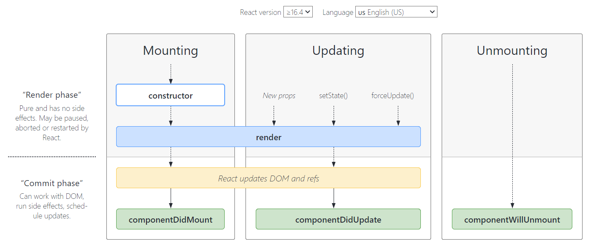

# Create react app
Create React App là một công cụ để tạo một ứng dụng React. Nó sẽ tạo ra một thư mục chứa các file và thư mục cần thiết để làm việc.

Tạo một ứng dụng react mới sử dụng Create React App trong terminal như sau:

```
npx create-react-app my-app
cd my-app
npm start
```

Khi sẵn sàng để deploy, chạy lệnh ```npm run build``` để tạo ra các file build của app trong folder `build`.
# JSX
JSX là một cú pháp mở rộng của JavaScript. Nó cho phép tạo ra các component trong JavaScript. Nó được sử dụng trong React để mô tả UI.

Ví dụ: 
```javascript
const element = <h1>Hello, world!</h1>;
```

Thêm biểu thức vào JSX sử dụng cặp ngoặc nhọn: 
```javascript
const name="Sara";
const element = <h1>Hello, {name}</h1>;
```

Bản thân JSX cũng là một biểu thức, do vậy có thể sử dụng JSX trong câu lệnh điều kiện, vòng lặp, gán nó cho một biến..

Thẻ JSX có thể có các children, các children được đặt trong thẻ:
```javascript
const element = (
  <div>
    <h1>Hello!</h1>
    <h2>Good to see you here.</h2>
  </div>
);
```

JSX đại diện cho các đối tượng React element. Babel compile JSX thành lời gọi `React.createElement()`. Hai ví dụ sau là như nhau:
```javascript
const element = (
  <h1 className="greeting">
    Hello, world!
  </h1>
);
```
```javascript
const element = React.createElement(
  'h1',
  {className: 'greeting'},
  'Hello, world!'
);
```

React đọc các đối tượng React element và sử dụng nó để tạo và cập nhật DOM.
# Components
Giao diện có thể chia thành các phần độc lập, tái sử dụng gọi là component.
Về mặt khái niệm, component tương tự như function: nó chấp nhận các input (gọi là props) và trả về React element dùng để mô tả màn hình hiển thị.

Có hai loại component:
1. `Function component`: 
```javascript
function Welcome(props) {
  return <h1>Hello, {props.name}</h1>;
}
```

2. `Class component`:
```javascript
class Welcome extends React.Component {
  render() {
    return <h1>Hello, {this.props.name}</h1>;
  }
}
```

## Render component
```javascript
function Welcome(props) {
  return <h1>Hello, {props.name}</h1>;
}

const element = <Welcome name="Sara" />;
ReactDOM.render(
  element,
  document.getElementById('root')
);
```
Quá trình render:
1. gọi hàm ReactDOM.render() với element `<Welcome name="Sara" />`
2. React gọi component `Welcome` với props là `{name: 'Sara'}`
3. Component `Welcome` trả về kết quả là element `<h1>Hello, Sara</h1>`
4. ReactDOM cập nhật DOM để match với `<h1>Hello, Sara</h1>`

Lưu ý: tên component phải bắt đầu bằng chữ cái viết hoa, các component bắt đầu bằng chữ cái thường được React coi như các thẻ DOM.
## Composing component
Một component có thể refer tới một component khác --> cho phép tái sử dụng các component.
Ví dụ:
```javascript
function Welcome(props) {
  return <h1>Hello, {props.name}</h1>;
}

function App() {
  return (
    <div>
      <Welcome name="Sara" />
      <Welcome name="Cahal" />
      <Welcome name="Edite" />
    </div>
  );
}

ReactDOM.render(
  <App />,
  document.getElementById('root')
);
```

## props are read-only
Component không được phép thay đổi giá trị props của nó.
# Props vs states
## state
Ví dụ về component Clock cập nhật đồng hồ mỗi giây:

```javascript
class Clock extends React.Component {
  constructor(props) {
    super(props);
    this.state = {date: new Date()};
  }

  componentDidMount() {
    this.timerID = setInterval(
      () => this.tick(),
      1000
    );
  }

  componentWillUnmount() {
    clearInterval(this.timerID);
  }

  tick() {
    this.setState({
      date: new Date()
    });
  }

  render() {
    return (
      <div>
        <h1>Hello, world!</h1>
        <h2>It is {this.state.date.toLocaleTimeString()}.</h2>
      </div>
    );
  }
}

ReactDOM.render(
  <Clock />,
  document.getElementById('root')
);
```

Thứ tự các phương thức được gọi như sau:
1. Khi `<Clock />` được truyền cho ReactDOM.render(), React gọi constructor của Clock component. Do Clock cần hiển thị thời gian hiện tại, nó khởi tạo `this.state` bằng một object có chứa thời gian hiện tại. State này sau đó sẽ được update.
2. React sau đó gọi phương thức `render()` của Clock và update DOM.
3. Khi Clock được insert vào DOM, React gọi `componentDidMount()`. Clock yêu cầu trình duyệt cài đặt một timer để gọi phương thức `tick()` của Clock mỗi giây.
4. Mỗi giây, trình duyệt gọi `tick()`. Trong `tick()`, Clock component cập nhật UI bằng cách gọi `setState()` với đối tượng mới chứa thời gian hiện tại. Lời gọi `setState()` giúp React biết state đã bị thay đổi, và nó gọi phương thức `render()` một lần nữa để cập nhật giá trị trả về. Sau đó React cập nhật DOM.
5. Nếu component Clock bị xóa khỏi DOM, React gọi `componentWillUnmount()` để dừng timer.

## lưu ý khi sử dụng state
1. Không sửa trực tiếp state mà phải dùng `setState()` để được re-render
2. React có thể gộp nhiều `setState()` thành một lần update duy nhất, `this.props` và `this.state` có thể được cập nhật bất đồng bộ, do vậy không nên dùng các giá trị này để tính toán state tiếp theo. Thay vào đó, sử dụng dạng thứ hai của `setState()` sử dụng tham số là hàm có hai tham số: state trước đó và props được sử dụng hiện tại. 
```javascript
this.setState((state, props) => ({
  counter: state.counter + props.increment
}));
```
3. state update được shallow merge: state gồm nhiều biến khác nhau, trong trường hợp update độc lập từng biến, chỉ có biến đó bị thay đổi còn các biến còn lại vẫn giữ nguyên.
4. state là dữ liệu local, component cha hoặc con không thể biết component này có state hay không. Một component có thể truyền dữ liệu ở state cho component con thông qua props.

## so sánh state và props
|                           PROPS                          |                      STATE                     |
|:--------------------------------------------------------:|:----------------------------------------------:|
| Dữ liệu được truyền từ component này sang component khác | Dữ liệu chỉ được truyền trong nội bộ component |
| immutable                                                | mutable                                        |
| props chỉ có thể đọc                                     | state có thể ghi và đọc                        |
# Conditional rendering

Trong React, có thể tạo các component khác nhau để gói lại các hành vi cần thiết. Sau đó, có thể lựa chọn render một trong số đó tùy theo trạng thái của ứng dụng.

- sử dụng biến element:
```javascript
render() {
    const isLoggedIn = this.state.isLoggedIn;

    // biến element
    let button;
    if (isLoggedIn) {
      button = <LogoutButton onClick={this.handleLogoutClick} />;
    } else {
      button = <LoginButton onClick={this.handleLoginClick} />;
    }

    return (
      <div>
        <Greeting isLoggedIn={isLoggedIn} />
        {button}
      </div>
    );
  }
```
- inline `if` sử dụng toán tử `&&`
```javascript
{unreadMessages.length > 0 &&
        <h2>
          You have {unreadMessages.length} unread messages.
        </h2>
      }
```
Nếu điều kiện là true, element ngay sau `&&` sẽ được xuất hiện trong output. Nếu là false, React sẽ bỏ qua element đó.

- inline if else với toán tử điều kiện `condition ? true : false`. Ví dụ:
```javascript
render() {
  const isLoggedIn = this.state.isLoggedIn;
  return (
    <div>
      {isLoggedIn
        ? <LogoutButton onClick={this.handleLogoutClick} />
        : <LoginButton onClick={this.handleLoginClick} />
      }
    </div>
  );
}
```
# Component lifecycle 
Mỗi component có nhiều "lifecycle method" có thể override để chạy code tại một thời điểm nào đó.


## Mounting
Các phương thức trong mounting được gọi theo thứ tự khi một thực thể của component được tạo và chèn vào DOM:
1. `constructor()`: gọi trước khi component được mount. Có hai mục đích chính khi sử dụng constructor:
  - khởi tạo local state bằng cách gán đối tượng cho `this.state`
  - gán phương thức xử lý sự kiện cho một thực thể
2. `render()`: là phương thức duy nhất bắt buộc implement trong class component. Khi được gọi, nó sẽ kiểm tra `this.props` và `this.state` và trả về đối tượng để render (React element, string, boolean,..)

Note: Hàm render() không nên chỉnh sửa state của component và trả về kết quả giống nhau với mỗi lần gọi, và hàm render() không tương tác trực tiếp với trình duyệt.

3. `componentDidMount()`: gọi ngay sau khi component được mount. Nên thực hiện:
- các giá trị khởi tạo cần đến DOM
- khởi tạo request tới network để lấy dữ liệu
- cài đặt các subscription. Lưu ý cần unsubcribe tại `componentWillUnmount()`

Có thể gọi `setState()` trực tiếp trong `componentDidMount`. Nó sẽ thực hiện thêm một lần rendering (trước khi trình duyệt cập nhật màn hình). Tuy nhiên cần sử dụng hợp lý vì nó có thể ảnh hưởng tới hiệu năng.
## Updating
Một update có thể gây ra bởi sự thay đổi của props hoặc state. Các phương thức sau được gọi theo thứ tự khi một component được re-render:
1. `render()`
2. `componentDidUpdate()`: gọi ngay sau khi xảy ra update (không gọi cho lần render đầu tiên). Nên thực hiện:
- các thao tác trên DOM khi component được update.
- thực hiện request tới network 

Ví dụ:
```javascript
componentDidUpdate(prevProps) {
  // Typical usage (don't forget to compare props):
  if (this.props.userID !== prevProps.userID) {
    this.fetchData(this.props.userID);
  }
}
```

Có thể gọi `setState()` trực tiếp trong `componentDidUpdate()` nhưng lưu ý cần bao nó lại trong một điều kiện để tránh vòng lặp vô hạn.
## Unmounting
Phương thức này được gọi khi component bị xóa khỏi DOM:
`componentWillUnmount()`: gọi ngay trước khi component bị unmount hoặc bị hủy. Nên thực hiện các cleanup cần thiết:
- xóa timer
- hủy network request
- unsubscribe

Không nên gọi `setState()` trong `componentWillUnmount` vì component sẽ không bao giờ được re-render.
# Lists and keys
## Render nhiều component
Ví dụ:
```javascript
const numbers = [1, 2, 3, 4, 5];

// với mỗi số trả về một element <li>
// listItems là một mảng các element <li>
const listItems = numbers.map((number) =>
  <li>{number}</li>
);
ReactDOM.render(
  <ul>{listItems}</ul>,
  document.getElementById('root')
);
```
Đoạn code trên hiển thị danh sách bullet các số từ 1 đến 5.

## List component cơ bản
Ví dụ:
```javascript
function NumberList(props) {
  const numbers = props.numbers;
  const listItems = numbers.map((number) =>
    <li key={number.toString()}>
      {number}
    </li>
  );
  return (
    <ul>{listItems}</ul>
  );
}

const numbers = [1, 2, 3, 4, 5];
ReactDOM.render(
  <NumberList numbers={numbers} />,
  document.getElementById('root')
);
```
Đoạn code trên refactor lại đoạn code ở phần render nhiều component.

Thông thường, chúng ta sẽ render danh sách trong một component. Với mỗi item trong listItems có thêm một attribute là `key`.

## Keys

Key giúp React xác định item nào được thêm vào/xóa đi/cập nhật. Các element trong một mảng nên có key để cho element đó một định danh.

Cách tốt nhất để chọn key là dùng một chuỗi unique (unique trong mảng, không nhất thiết phải unique global) để phân biệt các item với nhau, phổ biến nhất là sử dụng id trong data để làm key. Ví dụ:
```javascript
const todoItems = todos.map((todo) =>
  <li key={todo.id}>
    {todo.text}
  </li>
);
```

Nếu data không có id, chúng ta có thể sử dụng index là key. Tuy nhiên cách này không được recommend vì index của các item có thể thay đổi.

Key được React sử dụng nhưng không được truyền cho component. Do vậy, nếu component muốn sử dụng giá trị này thì cần truyền nó dưới dạng props với một tên khác.

## Embedding map() in JSX
Có thể sử dụng ngoặc nhọn để viết map() thành inline như sau:
```javascript
function NumberList(props) {
  const numbers = props.numbers;
  return (
    <ul>
      {numbers.map((number) =>
        <ListItem key={number.toString()}
                  value={number} />
      )}
    </ul>
  );
}
```
Cách viết này giúp code nhìn gọn hơn, tuy nhiên tùy trường hợp nếu bạn muốn tách thành biến để chương trình dễ hiểu hơn.

# Composition vs inheritance
Kiến trúc của React recommend sử dụng composition để tái sử dụng code thay vì inheritance.

Sau đây là một số trường hợp developer thường nghĩ đến sử dụng inheritance và đưa ra cách sử dụng composition thay thế:
## Containment
Một số component không biết các children của nó trước, điều này đặc biệt phổ biến cho các component như `Sidebar` hoặc `Dialog` đại diện cho các "box" chung.

React recommend các component này sử dụng prop đặc biệt `children` để truyền các children element trực tiếp. Ví dụ:
```javascript
function FancyBorder(props) {
  return (
    <div className={'FancyBorder FancyBorder-' + props.color}>
      {props.children}
    </div>
  );
}
function WelcomeDialog() {
  return (
    <FancyBorder color="blue">
      <h1 className="Dialog-title">
        Welcome
      </h1>
      <p className="Dialog-message">
        Thank you for visiting our spacecraft!
      </p>
    </FancyBorder>
  );
}
```
Tất cả mọi thứ bên trong thẻ `<Fancy Border>` được truyền vào component `FancyBorder` như là prop children.

## Specialization
Đôi khi chúng ta nghĩ một số component là trường hợp đặc biệt của component khác. Ví dụ, `WelcomeDialog` là một trường hợp đặc biệt của `Dialog`.

Trong React, điều này có thể thực hiện sử dụng composition, khi component "cụ thể" render component "tổng quát" và config nó sử dụng props. Ví dụ:
```javascript
function Dialog(props) {
  return (
    <FancyBorder color="blue">
      <h1 className="Dialog-title">
        {props.title}
      </h1>
      <p className="Dialog-message">
        {props.message}
      </p>
    </FancyBorder>
  );
}

function WelcomeDialog() {
  return (
    <Dialog
      title="Welcome"
      message="Thank you for visiting our spacecraft!" />
  );
}
```

# Basic Hooks
Hooks là một khái niệm mới kể từ React 16.8, chúng cho phép sử dụng state và các tính năng khác của React mà không cần viết class.

Hooks là các hàm cho phép "móc vào" React state và các chức năng lifecycle sử dụng function component. Hook không hoạt động bên trong class, chúng cho phép sử dụng React mà không cần class.

React cung cấp một số built-in Hooks vd như `useState`. Chúng ta cũng có thể tự tạo Hooks của mình để tái sử dụng một số hành vi stateful giữa các component khác nhau.
## useState
Ví dụ:
```javascript
import React, { useState } from 'react';

function Example() {
  // Declare a new state variable, which we'll call "count"
  const [count, setCount] = useState(0);

  return (
    <div>
      <p>You clicked {count} times</p>
      <button onClick={() => setCount(count + 1)}>
        Click me
      </button>
    </div>
  );
}
```
`useState()` định nghĩa một "state variable". Trong ví dụ trên, "state variable" được gọi là `count`. `useState` giúp thực hiện các khả năng giống hệt `this.state` trong class. Thông thường, các biến sẽ biến mất khi function exit nhưng các biến state được lưu giữ bởi React.

`useState` nhận một tham số duy nhất là giá trị khởi tạo của biến state, có thể là string, number, object,..

`useState` trả về một cặp giá trị: state hiện tại và một hàm sử dụng để cập nhật state đó. Hai giá trị này tương tự với `this.state.count` và `this.setState` trong class.

Đọc state:
```javascript
 <p>You clicked {count} times</p>
```
Cập nhật state:
```javascript
  <button onClick={() => setCount(count + 1)}>
    Click me
  </button>
```
## useEffect
Effect Hook cho phép thực hiện các side-effect trong function component: fetch data, thiết lập một subscription, thay đổi DOM trong React component. 
```javascript
import React, { useState, useEffect } from 'react';

function Example() {
  const [count, setCount] = useState(0);

  // Similar to componentDidMount and componentDidUpdate:
  useEffect(() => {
    // Update the document title using the browser API
    document.title = `You clicked ${count} times`;
  });

  return (
    <div>
      <p>You clicked {count} times</p>
      <button onClick={() => setCount(count + 1)}>
        Click me
      </button>
    </div>
  );
}
```
Trong ví dụ trên, chúng ta thêm một chức năng mới là thay đổi document title khi tăng số đếm.

Có thể nghĩ về `useEffect` tương tự như `componentDidMount`, `componentDidUpdate` và `componentWillUnmount` kết hợp với nhau.
Có hai kiểu side effect trong React component: kiểu cần cleanup và kiểu không cần cleanup.

### side effect không cần cleanup

Đôi khi chúng ta muốn chạy một số đoạn code sau khi React đã cập nhật DOM. Network request, thay đổi DOM, logging là những ví dụ phổ biến của side effect không cần cleanup, chúng ta chạy nó và quên đi nó ngay.

```javascript
import React, { useState, useEffect } from 'react';

function Example() {
  const [count, setCount] = useState(0);

  useEffect(() => {
    document.title = `You clicked ${count} times`;
  });

  return (
    <div>
      <p>You clicked {count} times</p>
      <button onClick={() => setCount(count + 1)}>
        Click me
      </button>
    </div>
  );
}
```
`useEffect` báo với React rằng component cần chạy một số thứ sau khi render. React sẽ ghi nhớ hàm được truyền, và gọi nó sau khi thực hiện cập nhật DOM.

`useEffect` đặt trong component giúp truy cập được state variable hoặc props (trong trường hợp này là `count`).

Mặc định, `useEffect` chạy sau lần render đầu tiên và sau mỗi lần update (cũng có nghĩa là sau mỗi lần render). React đảm bảo DOM đã được update trước khi nó chạy effect.

### side effect cần cleanup

Một số effect cần cleanup, ví dụ như thiết lập subscription tới một nguồn dữ liệu nào đó. Trong trường hợp đó, chúng ta cần cleanup để tránh rò rỉ bộ nhớ.

```javascript
import React, { useState, useEffect } from 'react';

function FriendStatus(props) {
  const [isOnline, setIsOnline] = useState(null);

  useEffect(() => {
    function handleStatusChange(status) {
      setIsOnline(status.isOnline);
    }
    ChatAPI.subscribeToFriendStatus(props.friend.id, handleStatusChange);

    // Specify how to clean up after this effect:
    return function cleanup() {
      ChatAPI.unsubscribeFromFriendStatus(props.friend.id, handleStatusChange);
    };
  });

  if (isOnline === null) {
    return 'Loading...';
  }
  return isOnline ? 'Online' : 'Offline';
}
```

`useEffect` nếu có hàm trả về thì hàm đó sẽ chạy nó khi cần cleanup. React thực hiện cleanup khi component unmount. React sẽ cleanup effect của lần render trước, trước khi chạy effect tiếp theo. 

### tips khi sử dụng useEffect
1. sử dụng nhiều effect, mỗi effect cho một tác vụ khác nhau
2. tối ưu hóa hiệu năng bằng cách skip effect: sử dụng tham số thứ hai của `useEffect()` là mảng các state và props mà khi những giá trị này thay đổi effect sẽ được chạy thay vì chạy effect sau mỗi lần render. Tham số thứ hai có thể là mảng rỗng `[]`, khi đó React sẽ chỉ chạy effect khi component mount và unmount.